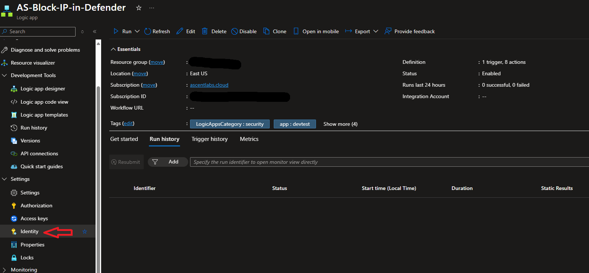
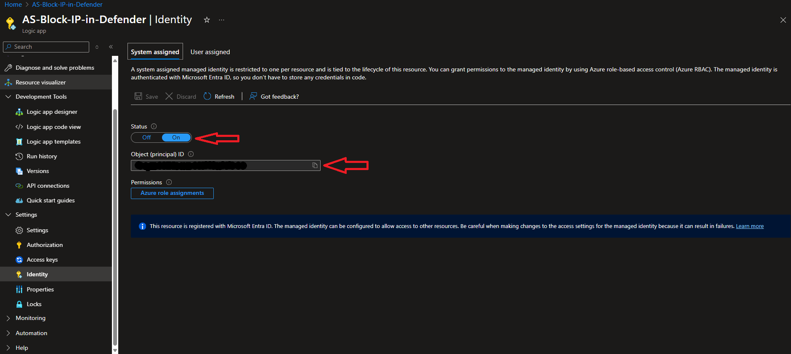
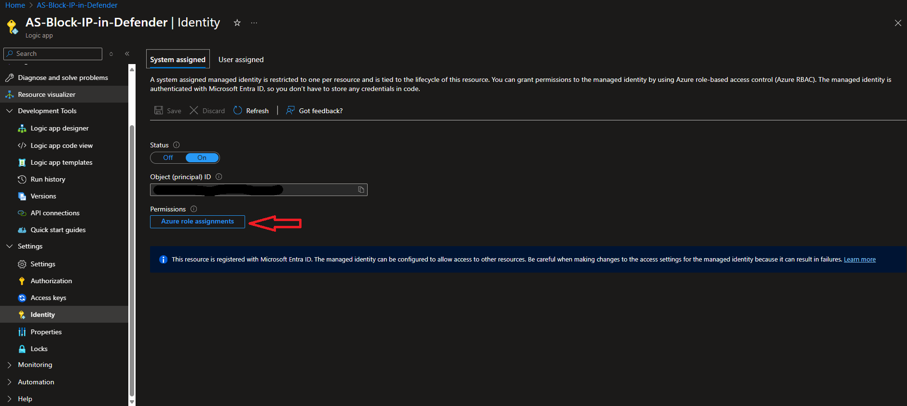
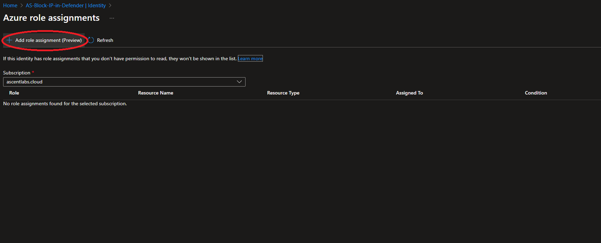

# Block IP in Defender

## Description

This playbook is designed to take IP entities from a Sentinel Incident and add them to the IOC endpoint block list in Microsoft Defender. The block is set to not create an alert by default and is set to not expire. These properties can be changed in the Defender portal once the block has been create. Default settings can be changed in the playbook by adjusting the HTTP post action.

## Prequisites

An admin with Privilege Role Admin or Global Admin will be needed to assign the necessary MDE API permissions to the Managed Identity.

## Quick Deployment

[](https://portal.azure.com/#create/Microsoft.Template/uri/https%3A%2F%2Fraw.githubusercontent.com%2FAscent-Solutions-LLC%2FProServ_AutomationKits%2Fmain%2FPlaybooks%2FAdd-IP-to-Custom-Indicator-list%2FBlock_IP_in_Defender.json)

## Post Deployment

Once the playbook has been successfully deployed, navigate to the managed identity. This can be located in the Identity tab under Settings on the left blade. Make sure the System-Assignmed managed identity is enabled, this should be the case by default.


1) Copy the Managed Identity's Object ID, this will be needed for assigning API privileges

2) Select the Azure Role Assignement button and assign the Microsoft Sentinel
Responder role to the MID


3) Open an Azure CLI cloud shell and run the following script. Be sure to replafce the managed identity object id placeholder with the object ID copied from earlier.

```powershell
# Replace with your managed identity's Object ID
$miObjectID = "<your-managed-identity-object-id>"

# Defender for Endpoint App ID
$appId = "fc780465-2017-40d4-a0c5-307022471b92"

Connect-AzureAD

$app = Get-AzureADServicePrincipal -Filter "AppId eq '$appId'"

$role = $app.AppRoles | Where-Object { $_.Value -eq "Ti.ReadWrite" } | Select-Object -First 1

New-AzureADServiceAppRoleAssignment -Id $role.Id -ObjectId $miObjectID -PrincipalId $miObjectID -ResourceId $app.ObjectId
```
