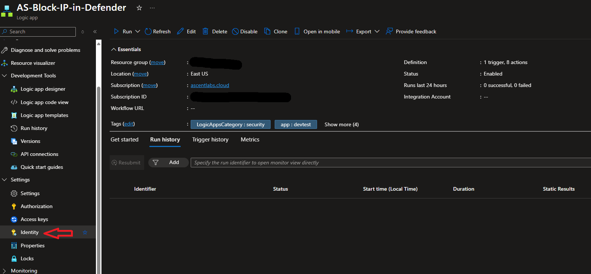

# Isolate Device in MDE

## Description

This playbook will use device entities from Sentinel/MDE generated incidents and isolate those devices using MDE. This is accomplished via the Windows Defender Advanced Threat Protection (WDATP) API. The playbook utilizes the System-Assigned Managed Identity to interact with the incident, retrieve the entities, submit the isolation in MDE, and update the incident with a comment. This playbook will require specific permissions which will be addressed in the requirements section.

## Requirements

MDE API permissions are going to require a user with Global Admin (GA) or Privileged Role Admin permissions. A Azure CLI powershell script is available below to deploy those rules. This will be done after the deployment of the playbook. Appropriate permissions to assign the RBAC permssions of Sentinel Responder to the managed identity will also be required.

## Quick Deployment

[](https://portal.azure.com/#create/Microsoft.Template/uri/https%3A%2F%2Fraw.githubusercontent.com%2FAscent-Solutions-LLC%2FProServ_AutomationKits%2Fmain%2FPlaybooks%2Isolate-Device-in-MDE%2FIsolate-Device-in-MDE)

Deployment will require the choice of API deployment region. By default the parameter is set to EastUS. You can adjust the parameter depending on needs. Verify the closest region that the API is hosted for your needs.

## Post Deployment

Once the playbook has been successfully deployed, navigate to the managed identity. This can be located in the Identity tab under Settings on the left blade. Make sure the System-Assignmed managed identity is enabled, this should be the case by default.


1) Copy the Managed Identity's Object ID, this will be needed for assigning API privileges
2) Select the Azure Role Assignement button and assign the Microsoft Sentinel
Responder role to the MID
3) Open an Azure CLI cloud shell and run the following script. Be sure to replafce the managed identity object id placeholder with the object ID copied from earlier.

```powershell
$MIGuid = '<Enter your managed identity guid here>' 

$MI = Get-AzureADServicePrincipal -ObjectId $MIGuid 

$MDEAppId = 'fc780465-2017-40d4-a0c5-307022471b92' 

$PermissionName = 'Machine.Isolate' 

$MDEServicePrincipal = Get-AzureADServicePrincipal -Filter 'appId eq '$MDEAppId'' 

$AppRole = $MDEServicePrincipal.AppRoles | Where-Object {$_.Value -eq $PermissionName -and $_.AllowedMemberTypes -contains 'Application'} 

New-AzureAdServiceAppRoleAssignment -ObjectId $MI.ObjectId -PrincipalId $MI.ObjectId ` -ResourceId $MDEServicePrincipal.ObjectId -Id $AppRole.Id
```
