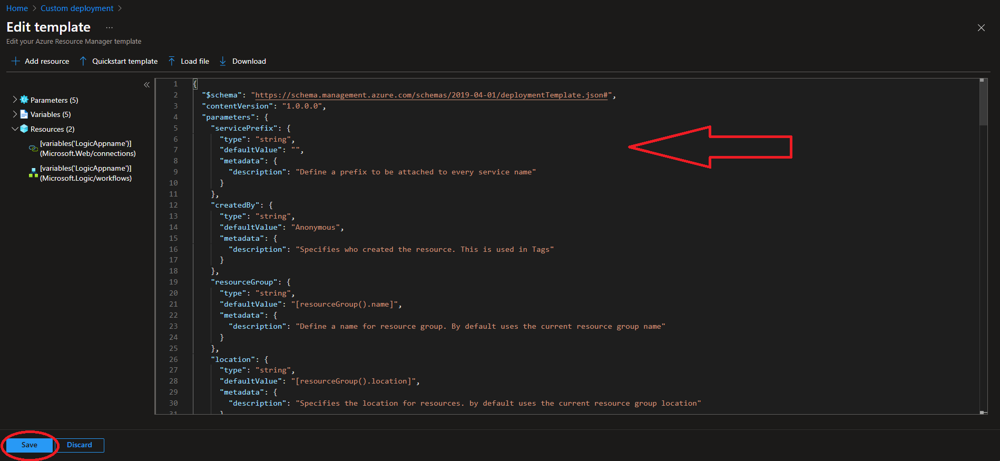
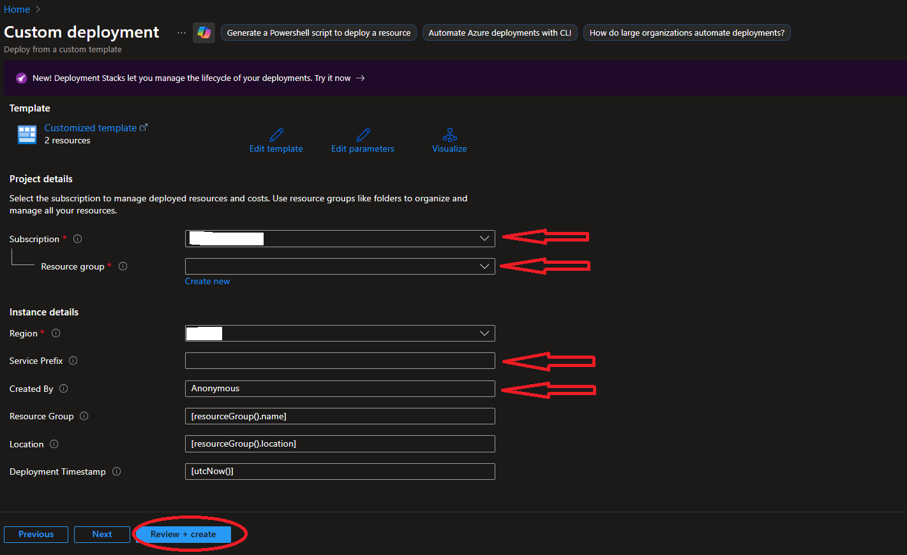
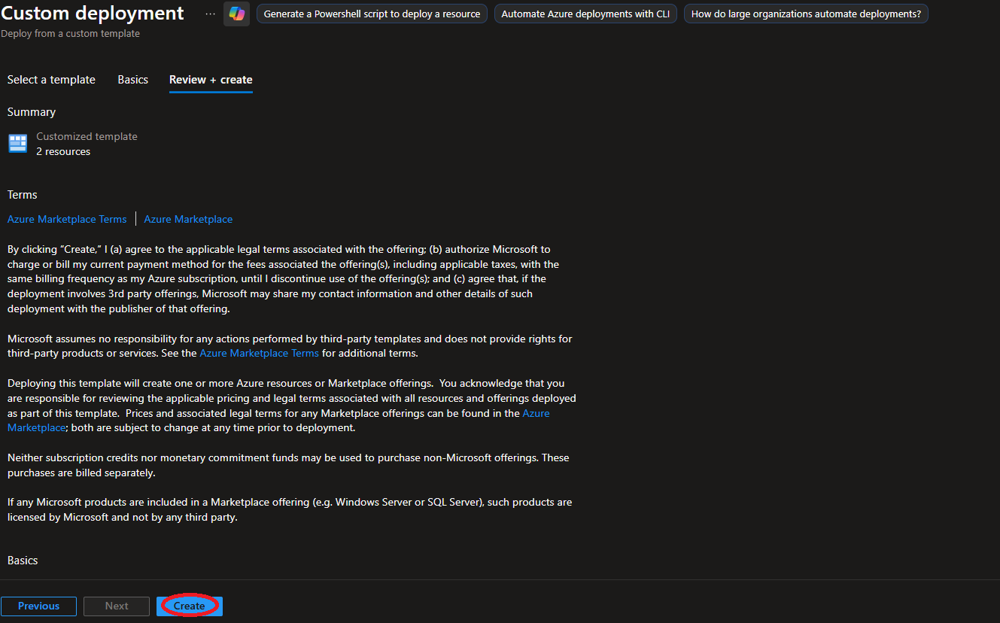
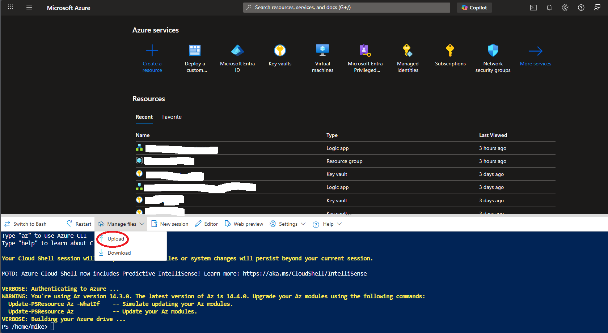

### Requirements
The following items are required for the deployment of this playbook:
- A Microsoft Sentinel Workspace
- Resource Group for the playbooks
- MgGraph PowerShell Module if using local PowerShell instead of the Azure CLI
- A user with Privileged Role Admin or Global Admin permissions
- Owner over the Sentinel workspace or resource group or User Access Administrator role in subscription

This playbook will deploy the following resources:
- Logic App
- Managed Identity for Logic App
- Microsoft Sentinel API connection for Managed Identity
    
Required permissions for Managed Identity
- Sentinel Contributor role
- User.ReadWrite.All Graph API permissions

### Deployment of Playbook

#### ARM Template

  - Open Azure Portal and search for "**Deploy a custom template**" in the search bar
  
  - Select "**Build your own template in the editor**"
  
  - Paste in the contents of "Revoke_Entra_ID_User_Session.json" file and click Save
  
  - Choose subscription and the Resource Group for deployment. Optionally add a "Service Prefix" to the playbook title and select a "Created By" Name. The playbook will contain the base title "**Revoke-EntraID-User-Session**", then select "**Review + create**"
  
  - Once validation completes, click "**Create**"
  


#### Bicep File

  - Open an Azure CLI shell
  
  - Upload the bicep file to your shell directory
  
  - Run the deployment commands in the Azure CLI, replace the "YOUR-RG-HERE" placeholder with the Resource Group you want to use.
  
      ```powershell
      az deployment group create --name "Revoke_Entra_ID_User_Session" --resource-group "YOUR-RG-HERE" --template-file revoke_entra_id_user_session.bicep
      ```

### Post Deployment

1. Assign Sentinel Responder role to the playbook's service Managed Identity.
2. Assign **User.ReadWrite.All** Graph API permission to the managed identity using the following PowerShell commands in the Azure CLI. Replace the "**OBJECTID**" placeholder with Object ID for the Managed Identity.

#### PowerShell for granting permissions for Managed Identity

```powershell
# Add the correct 'Object (principal) ID' for the Managed Identity
$ObjectId = "OBJECTID"
# Add the correct Graph scope to grant
$graphScope = "User.ReadWrite.All"
Connect-MgGraph -Scope AppRoleAssignment.ReadWrite.All
$graph = Get-MgServicePrincipal -Filter "AppId eq '00000003-0000-0000-c000-000000000000'"
$graphAppRole = $graph.AppRoles | ? Value -eq $graphScope
$appRoleAssignment = @{
    "principalId" = $ObjectId
    "resourceId"  = $graph.Id
    "appRoleId"   = $graphAppRole.Id
}
New-MgServicePrincipalAppRoleAssignment -ServicePrincipalId $ObjectID -BodyParameter $appRoleAssignment | Format-List
```
