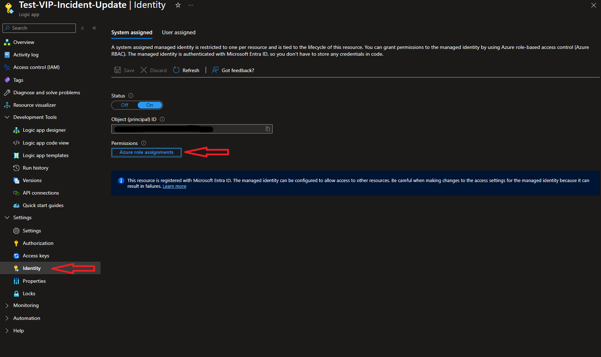
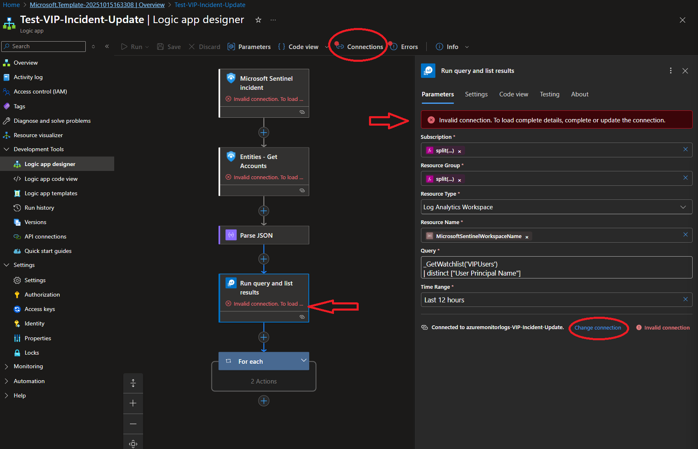
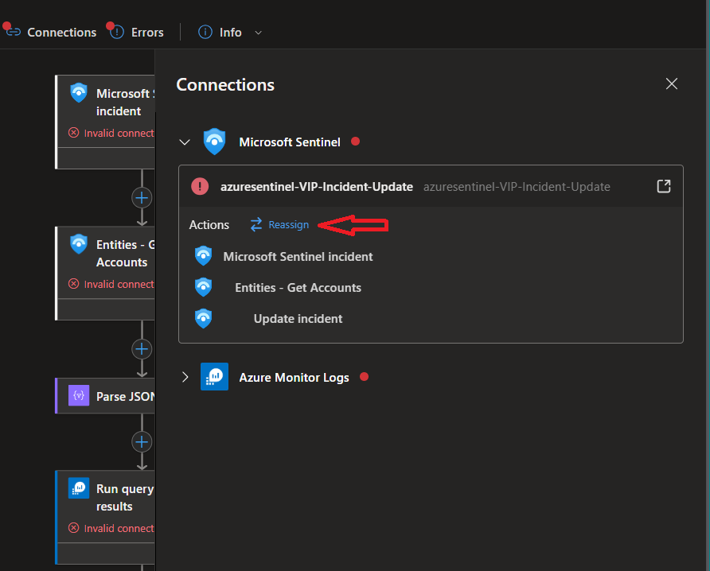
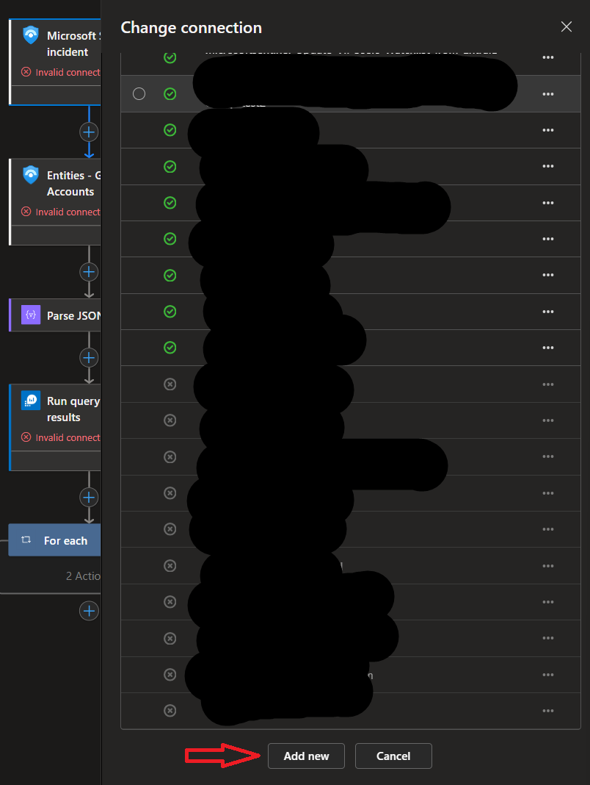
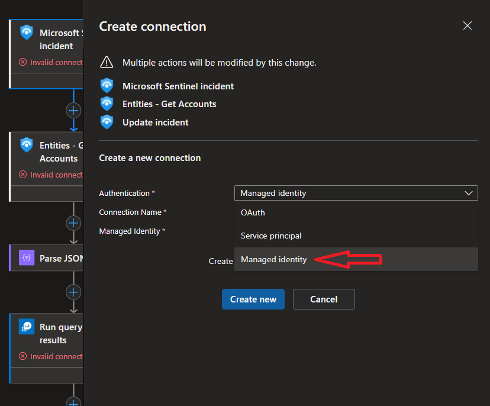
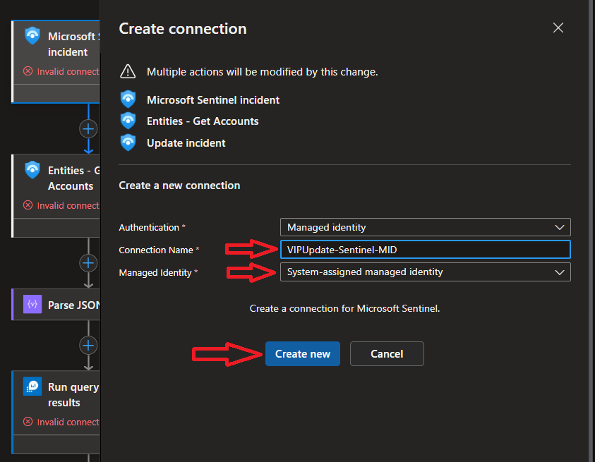

# Update Incident Containing VIP

## Description

This playbook is intended to work with a VIPUser watchlist. This watchlist can be deployed as a template from within the watchlist blade in Sentinel. If you have already deployed the VIPUser watchlist as apart of the Update-VIPUser-Watchlist-from-EntraID-Group, then you can ignore that prerequisite step below.

This playbook will compare any account entities in a Sentinel incident against the VIP watchlist and will update the incident to a high severity and tag it with a 'VIP' tag. Additional actions can be added after deployment to send Teams messages or an email but those steps are not apart of this base template.

## Prerequisites

The VIPUser watchlist needs to be deployed in your Sentinel workspace. It is recommended that the [VIP-User-Watchlist playbook](https://github.com/Ascent-Solutions-LLC/ProServ_AutomationKits/tree/main/Playbooks/Update-VIPUsers-Watchlist-from-EntraID-Group) is deployed to keep your watchlist up to date with active VIP users.

A user with Owner over the Subscription or Resource Group where the playbook is being deployed, the User Access Administrator role or any custom role that has the Microsoft.Authorization/roleAssignments/write permissions. These will be required post deployment to assign the Log Analytics Reader and Sentinel Responder role to the System-Assigned Managed Identity for the playbook.

## Quick Deployment

## Post Deployment

Find the System-Assigned managed identity in the Identity blade under Settings.

Select the Azure role assignments button and add Sentinel Responder and Log Analytics Reader to the Managed Identity.

The connections for all Sentinel actions and the Log Analytics actions will need to be changed to the Managed Identity. Select 'Connections' on the top options blade.

Click the arrow on the conenction you want to change and select 'reassign'. At the bottom of the change connection pop-up, select 'Add new'

Select 'Managed identity' in the Authentication section and make sure the Managed Identity section is set as 'System-assigned managed identity'.

Create a Connection Name to your schema and select 'Create new'.

Repeat this step for the 'Run query and list results' action.