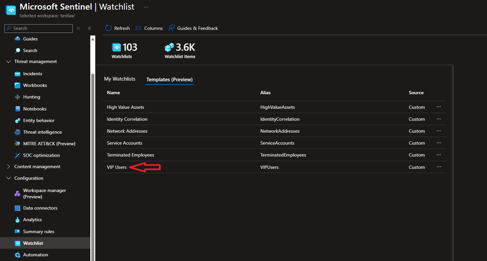

# VIPUsers Watchlist Update From EntraID Group

## Description

This playbook is used to update the Microsoft Sentinel VIP Users watchlist by syncing to a specified EntraID VIP User group. This playbook is designed to run once per day, add any new VIP users from the EntraID VIP group to the watchlist and also remove users from the watchlist that are no longer on the EntraID VIP group.

## Prerequisites

1) A VIP user watchlist must be deployed for the playbook to target for updates. There is a VIP User watchlist template available in the watchlist deployment tab in sentinel 

    Watchlists can't be deployed empty so a sample csv is available in this repo for use with first deployment. It is recommended that you replace the information with that of an actual user that will be in the VIP group in EntraID to avoid errors. [VIP Watchlist csv template](VIPUserTemplate.csv)

    For information on what is required for the VIP users watchlist, consult this Microsoft documentation: [VIP User watchlist schema](https://learn.microsoft.com/en-us/azure/sentinel/watchlist-schemas#vip-users)

2) An EntraID security group needs to be created for your VIP user. If one does not already exist, one must be created and members must be added. Once created, the object ID for the security group must be copied and will be used later during the playbook deployment.

    This group can be created as a standard group or a dynamic group. Standard groups will require new members to be manually added and removed (if user is still active in the org). A dynamic group and automatically add users based on tags or job title. [Dynamic Group Membership](https://learn.microsoft.com/en-us/entra/identity/users/groups-dynamic-membership)

## Quick Deployment

[](https://portal.azure.com/#create/Microsoft.Template/uri/https%3A%2F%2Fraw.githubusercontent.com%2FAscent-Solutions-LLC%2FProServ_AutomationKits%2Fmain%2FPlaybooks%2FUpdate-VIPUsers-Watchlist-from-EntraID-Group%2FVIPUser_Watchlist_Update.json)

## Post-Deployment

The playbook will require the system-assigned anaged identity to be enabled. The managed identity will require Microsoft Sentinel Contributor role, Log Analytics Reader role which can be assigned in the Identity blade under the Settings tab in the logic app.

Now you need either to assign User Administrator role in Azure AD or to grant following API permissions to the managed identity:

|Microsoft Graph API|Permissions|Playbook connection|
|--------|-----------|-----------|
|GET /groups/{id}|GroupMember.Read.All, Group.Read.All, Directory.Read.All, Group.ReadWrite.All, Directory.ReadWrite.All| HTTP - Get Group details|
|GET /groups/{id}/members|GroupMember.Read.All, Group.Read.All, GroupMember.ReadWrite.All, Group.ReadWrite.All, Directory.Read.All|HTTP - Get VIP Azure AD Group Members|
|GET /users/{id or userPrincipalName}|User.Read.All, User.ReadWrite.All, Directory.Read.All, Directory.ReadWrite.All|HTTP - does user have SID|
|POST /groups/{id}/checkMemberGroups|GroupMember.Read.All, Group.Read.All, Directory.Read.All, Directory.ReadWrite.All|HTTP - check is the Watchlist user still member of Azure AD group|

```powershell
$MIGuid = "<Enter your managed identity guid here>"
$MI = Get-AzureADServicePrincipal -ObjectId $MIGuid

$GraphAppId = "00000003-0000-0000-c000-000000000000"
$PermissionName1 = "User.Read.All"
$PermissionName2 = "User.ReadWrite.All"
$PermissionName3 = "GroupMember.ReadWrite.All"
$PermissionName4 = "GroupMember.Read.All"
$PermissionName5 = "Group.Read.All"
$PermissionName6 = "Directory.Read.All"
$PermissionName7 = "Group.ReadWrite.All"
$PermissionName8 = "Directory.ReadWrite.All"

$GraphServicePrincipal = Get-AzureADServicePrincipal -Filter "appId eq '$GraphAppId'"
$AppRole1 = $GraphServicePrincipal.AppRoles | Where-Object {$_.Value -eq $PermissionName1 -and $_.AllowedMemberTypes -contains "Application"}
New-AzureAdServiceAppRoleAssignment -ObjectId $MI.ObjectId -PrincipalId $MI.ObjectId `
-ResourceId $GraphServicePrincipal.ObjectId -Id $AppRole1.Id

$AppRole2 = $GraphServicePrincipal.AppRoles | Where-Object {$_.Value -eq $PermissionName2 -and $_.AllowedMemberTypes -contains "Application"}
New-AzureAdServiceAppRoleAssignment -ObjectId $MI.ObjectId -PrincipalId $MI.ObjectId `
-ResourceId $GraphServicePrincipal.ObjectId -Id $AppRole2.Id

$AppRole3 = $GraphServicePrincipal.AppRoles | Where-Object {$_.Value -eq $PermissionName3 -and $_.AllowedMemberTypes -contains "Application"}
New-AzureAdServiceAppRoleAssignment -ObjectId $MI.ObjectId -PrincipalId $MI.ObjectId `
-ResourceId $GraphServicePrincipal.ObjectId -Id $AppRole3.Id

$AppRole4 = $GraphServicePrincipal.AppRoles | Where-Object {$_.Value -eq $PermissionName4 -and $_.AllowedMemberTypes -contains "Application"}
New-AzureAdServiceAppRoleAssignment -ObjectId $MI.ObjectId -PrincipalId $MI.ObjectId `
-ResourceId $GraphServicePrincipal.ObjectId -Id $AppRole4.Id

$AppRole5 = $GraphServicePrincipal.AppRoles | Where-Object {$_.Value -eq $PermissionName5 -and $_.AllowedMemberTypes -contains "Application"}
New-AzureAdServiceAppRoleAssignment -ObjectId $MI.ObjectId -PrincipalId $MI.ObjectId `
-ResourceId $GraphServicePrincipal.ObjectId -Id $AppRole5.Id

$AppRole6 = $GraphServicePrincipal.AppRoles | Where-Object {$_.Value -eq $PermissionName6 -and $_.AllowedMemberTypes -contains "Application"}
New-AzureAdServiceAppRoleAssignment -ObjectId $MI.ObjectId -PrincipalId $MI.ObjectId `
-ResourceId $GraphServicePrincipal.ObjectId -Id $AppRole6.Id

$AppRole7 = $GraphServicePrincipal.AppRoles | Where-Object {$_.Value -eq $PermissionName7 -and $_.AllowedMemberTypes -contains "Application"}
New-AzureAdServiceAppRoleAssignment -ObjectId $MI.ObjectId -PrincipalId $MI.ObjectId `
-ResourceId $GraphServicePrincipal.ObjectId -Id $AppRole7.Id

$AppRole8 = $GraphServicePrincipal.AppRoles | Where-Object {$_.Value -eq $PermissionName8 -and $_.AllowedMemberTypes -contains "Application"}
New-AzureAdServiceAppRoleAssignment -ObjectId $MI.ObjectId -PrincipalId $MI.ObjectId `
-ResourceId $GraphServicePrincipal.ObjectId -Id $AppRole8.Id
```
